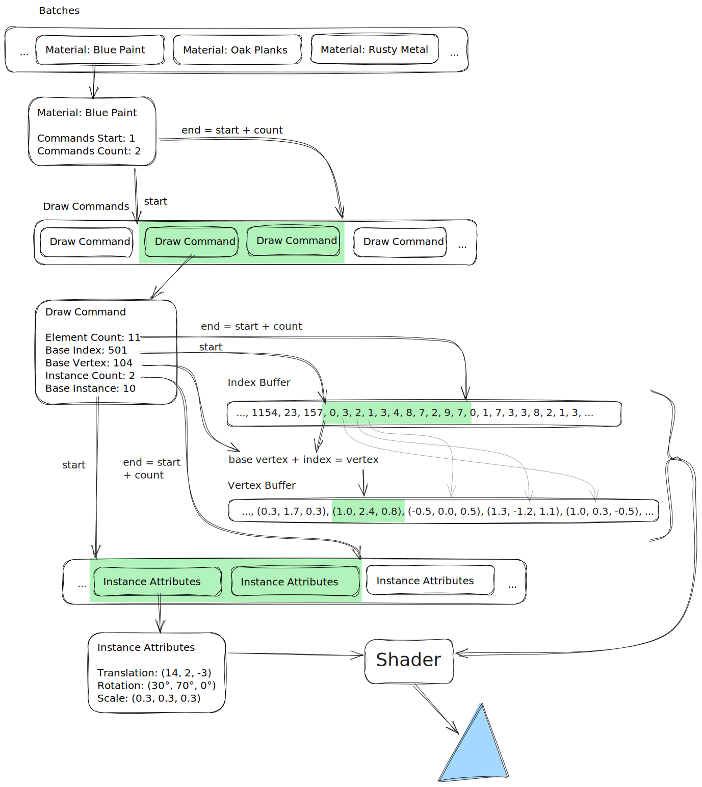

# References

https://www.khronos.org/opengl/wiki/Vertex_Rendering#Indirect_rendering
https://www.khronos.org/opengl/wiki/Vertex_Specification#Instanced_arrays
https://registry.khronos.org/OpenGL-Refpages/gl4/html/glMultiDrawElementsIndirect.xhtml

# Overview

The vertex array holds references to vertex buffers that
contain all the scenes' mesh data, this includes
- the vertex attributes (position, uv, normal)
- the element indices
- the per instance attributes (transformation matrix)
The vertex array also specifies the layout of these buffers.

The "draw indirect buffer" contains all the informations to specify
how to draw the provided data.
It contains various offsets and counts that dictate which ranges
of the vao need to be drawn.

The gltf loading & assembly is optimized to group draw commands into batches.
The data in the vertex buffers is arranged such that "sections" that use
the same material are contiguous.
A draw command is created for every section.
The batch specifies the range (start and count) of all commands that use this material.

The draw commands and vao data is sorted by the material index.

Finally the entire scene can be rendered with **only one** `glMultiDrawElementsIndirect` call per material.

# Batching

When a scene is properly created in blender and exported using glTF,
the resulting file will only use references to meshes and materials with multiple users.
Meaning it will not contain duplicate data.
Furthermore the glTF format splits meshes up into "primitves". 
They are sections of larger meshes that share a material.
When loading the file the indirect draw commands are optimized to take advantage of these "sections".

Overview:
- All meshes are loaded and split up into "chunks"  
  A chunk is a glTF "primitive", so part of a mesh with the same material.
  The chunks hold pointers into the gltf data that will be used later.
- Once all chunks of a scene are available, they are sorted by their material index
- The chunk's referenced data is copied into the vertex and element buffers.  
  After this step all triangles sharing the same material will be contiguously in memory.
- For each chunk a draw command is recorded  
  After this step all draw commands sharing the same material will be contiguously in memory.
- For every material a batch is created, storing the start of the draw commands and their count

The draw commands also use instancing.

# Per object data

Per object data is stored in a seperate vertex buffer and uses the attribute divisor to handle instancing.